# Travel Itinerary | 10 Days in Paris Pt. 1

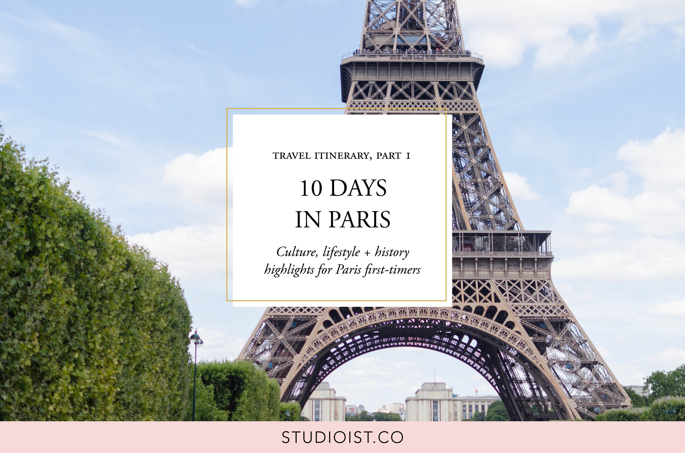

I don’t think there is any other city that evokes the emotions and glamour quite like Paris does. People dream of visiting and locals are obsessed. This city will capture your heart with its charm, history, architectural beauty, and history. Needless to say, I (along with half the world) want to call Paris home.

Over the centuries the city has been home to some of the most influential artists, painters, intellectuals, politicians, historical events, and cultural significant events.

More songs, poems, quotes, or art has been created about the City of Light than any other metropolis (that’s not factually substantiated, though does seems accurate to anyone who has visited).

The city is beyond picturesque! I’m even sure a word exists to capture the magic the city exudes. Enchanting is probably as close as I can get.

I could spend 1000 days in Paris and there would still be more to see, but ten days is a reasonable start for a first time visitor, and I’ve pulled together the perfect itinerary filled with iconic sights, historic monuments, glimmering lights, cafe life, bohemians alleyways, and cullllture (make sure to roll your tongue a bit when you say that last one). :)

Note: This is a full-on, packed itinerary with tons of walking. LeBraun and I love walking everywhere but if you need to rest or grab a cab occasionally, by all means do what is most comfortable for you. You will enjoy your time much more if you are comfortable. Because of this quality shoes are a packing essential.

Lastly don't forget to check the local calendar for festivals, events, and holidays. We just happened to be in Paris during the final leg of Le Tour de France so were able to watch cyclists circle the Tuileries Gardens up to the Champs-Élysées, complete with bleu, blanc et rouge flyover. Pretty neat!

<!-- [[ Day 1 ]] -->
<v-divider label="Day 1" />

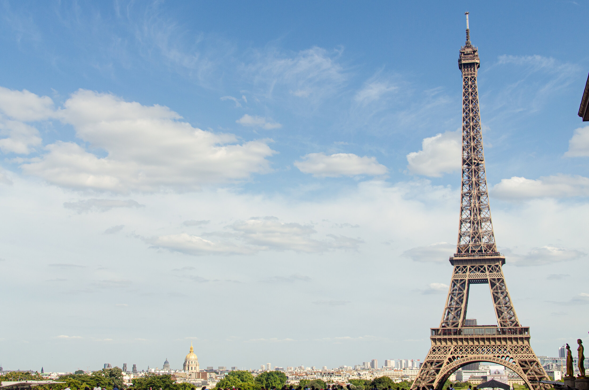

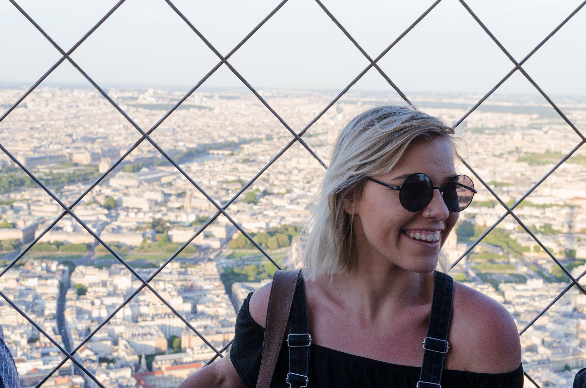

| | |
| - | - |
|  | 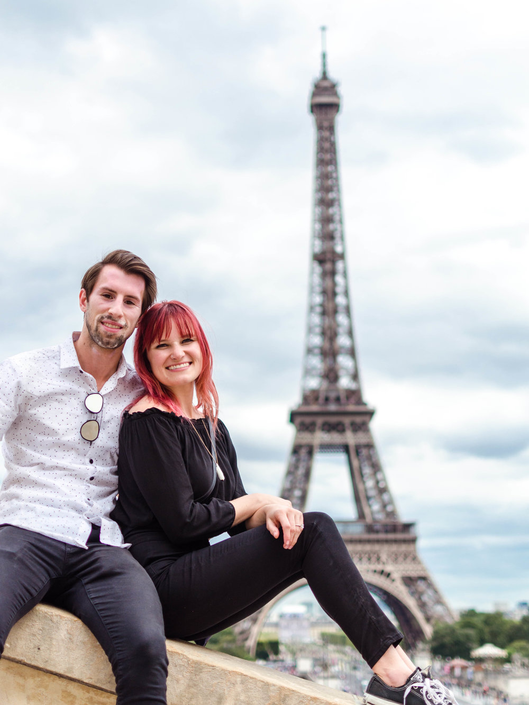 |

 

## BIENVENUE A PARIS!

Depending what time you arrive in the morning you may have to adjust the rest of the day, but we arrived bright and early so had the entire day to enjoy.

**8 A.M.** — Land in France, clear customs, and get a car to your hotel in the city.

**9:30 A.M.** — Check in to hotel, freshen up, and change, or if you can’t check in yet arrive at your hotel, freshen up, change, and store your bags.

**9:45 A.M.** — Grab some brunch at a cafe near your hotel. Don’t forget to start your day with a freshly baked croissant!

**11 A.M.** — Get out and walk a bit around your hotel. Admire the architecture and soak in the beauty and culture of the city while moving your legs after sitting on a plane.

**1 P.M.** — Grab a baguette, some charcuterie items, and a bottle of wine then head towards The Trocadéro.

**The Trocadéro** is a large plaza area featuring fountains and green spaces located just across the Seine from The Eiffel Tower. You’ve definitely seen at least 100 proposals that took place on the plaza on Instagram. It’s a lovely spot! Throughout the year the plaza hosts entertainment like performers and musicians. Take tons of photos as you make your way across the river.

**2:30 P.M.** — Remember those groceries we picked up early? Well this is where they come in. Snag a spot on the lawn around France’s (nah the world’s) most iconic structure, relax, and enjoy an afternoon picnic. :)

**4 P.M.** — There’s something magical about seeing **The Eiffel Tower** for the first time! The wrought-iron criss-crossing up to a point, towering above the skyline. You can get walk up tickets, but to save yourself time purchase your tickets for a specific time online a few weeks before you arrive. 

For a different view of the structure, opt to take the 670 stairs to the second floor, then ride the elevator to the summit. Take time to walk around each level and take in the structure’s 360 degree views, keeping a lookout for other Parisian monuments scattered around. 

From nightfall to 1 a.m. every night, The Eiffel Tower lights up with 20,000 bulbs (5,000 per side) that sparkle for five minutes on the hour, every hour.

**7 P.M.** — Grab dinner near your hotel (or in your hotel if the restaurant is well-rated). By this point you’ll probably be crashing so shower and get a good night sleep. 

<!-- [[ Day 2 ]] -->
<v-divider label="Day 2" />

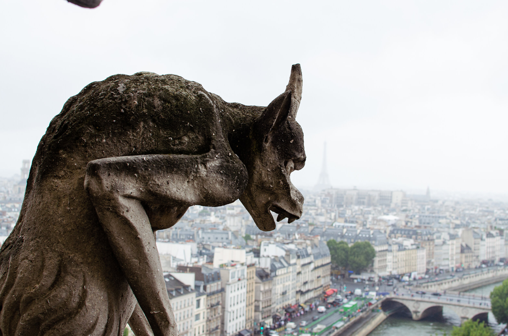

| | |
| - | - |
| 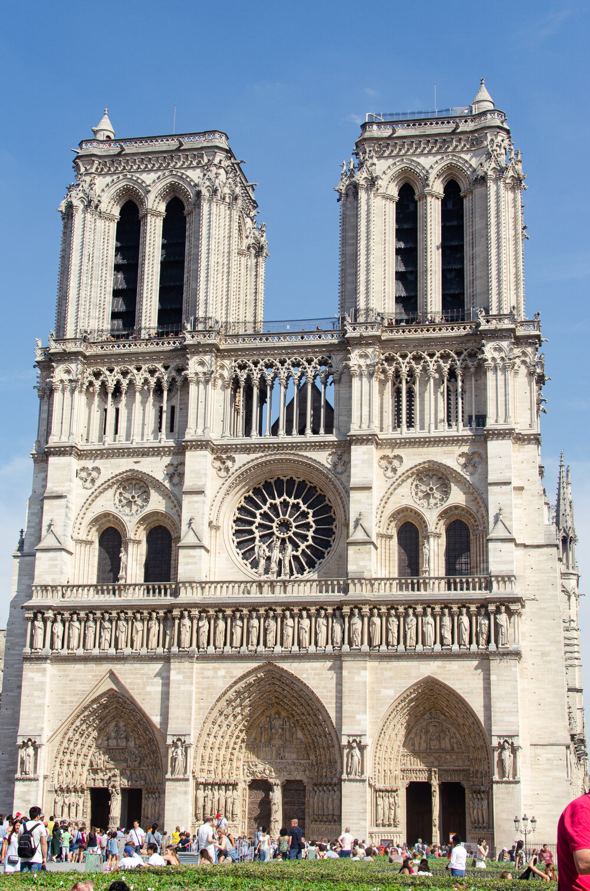 | 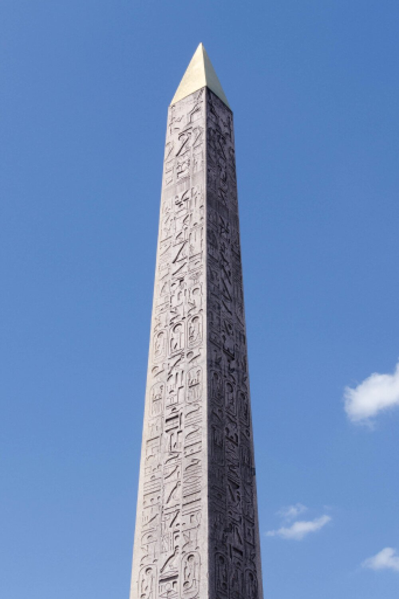 |
| 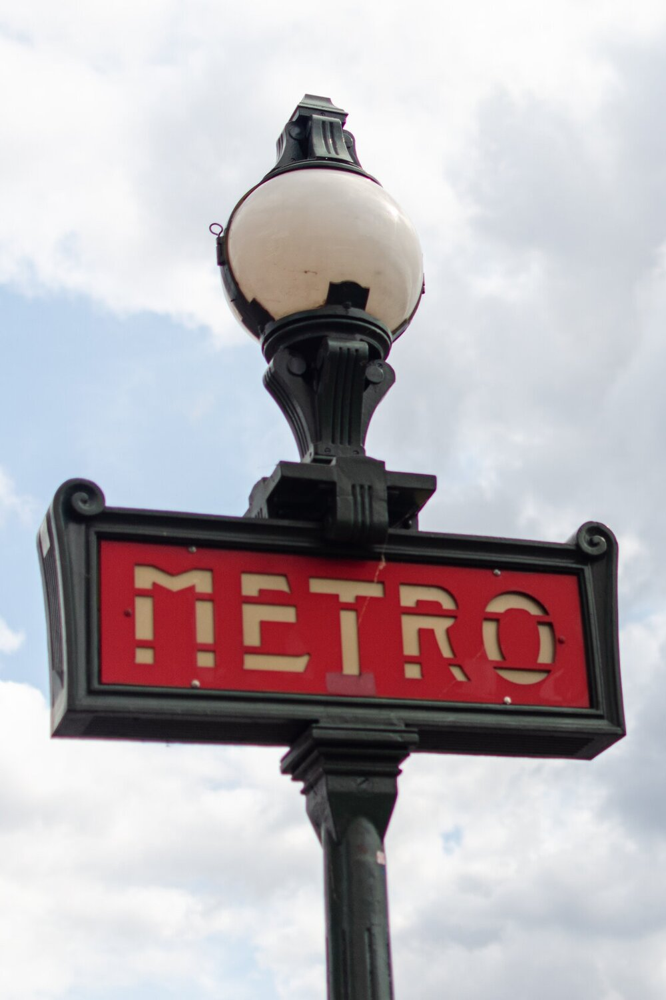 | 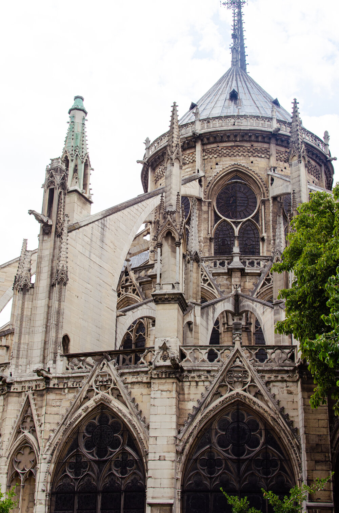 |

## SIGHTSEEING & NOTRE-DAME CATHEDRAL

Paris is a large, read out city and there is no way to see everything during a 10-day visit (though we are trying our best to give you a wide-range of activities and areas to explore). The easiest way to get your footing and the general layout of a city you’re exploring is by hopping on a bus tour. You definitely feel like a huge tourist, but the tours typically have great overview information and get your around town cheaper than a taxi or ride-share. 

In Paris, we enjoyed our time with [Paris L’Open Bus Tours][0] because they offered 4 daytime routes, mutli-day passes, discounted museum entry, night tours, and even a river boat tour, allowing visitors to move around the city and see everything the way they want to see it. We did the two-consecutive days pass.

I’d recommend the Paris Sightseeing Tour (green route) first, which provides you a great overview of the sightseeing highlights. During the summer the route ran from 9:30 a.m. - 8:30 p.m. with pickups roughly every 10 minutes. 

**7:30 A.M.** — Make reservation for time slot to visit the Notre Dame Towers on your phone. Find more information below.

**9 A.M.** — Fuel up for the day with a hearty breakfast!

**10 A.M.** — Start the tour at the beginning (Stop: Auber - 13 rue Auber 75009 Paris) then disembark on the Ile de la Cité at Stop: Notre Dame - 6 rue de la Cité).

The **Cathedral of Notre-Dame de Paris**, meaning Our Lady of Paris, is truly the heart and soul of this city. This Gothic masterpiece of French architecture has stood here on the Île de la Cité between the banks of the Seine since construction began in 1160. It was “completed” in 1345, more than 180 years later. Much of the imagery was desecrated during the French Revolution, but the publication of Victor Hugo’s classic The Hunchback of Notre Dame spurred major reconstruction of this landmark.

**10:45 A.M.** — Join the queue out front of the Cathedral. It moves quickly. Once inside explore one of the largest and most beautiful churches in France, and one of the great cathedrals of the world. With huge vaulted ceilings that protect the 13th century stained-glass rose windows—they’re simply breathtaking! When you’re done head back outside.

**12:15 P.M.** — If you’re facing the front facade of Notre Dame, walk to the left side of the building and there you will find the entry gates for **The Towers**. Unlike the main entrance, there is no physical queue for entry. Instead you need to download the JeFile app and choose your preferred entry time. Arrive at the Towers entrance roughly 10 minutes before your time. Reservations on the app can be made starting at 7:30 a.m. every morning and time slots can only be selected for that same day.

The time slot reservation is free but once inside you’ll need to purchase a ticket before climbing the 387 stairs to the lookout. Enjoy the beautiful views over Paris, get up close with the cathedral’s iconic gargoyles, and tour the bells. There is no elevator and will also need to walk back down when you’re finished.

Note: You may need to adjust these activities according to what time your Towers entry ends up being.

Don’t forget to take a walk around the exterior of the cathedral. It’s just as grand as the interior and it’s placement within Paris provides beauty views across the river.

**2 P.M.** — I’d recommend grabbing a sandwich takeaway and enjoying by the Seine or in the park behind the cathedral. We've got lots more to see and it’s only our first day!

[0]: http://opentour.preprod-site.fr/en/

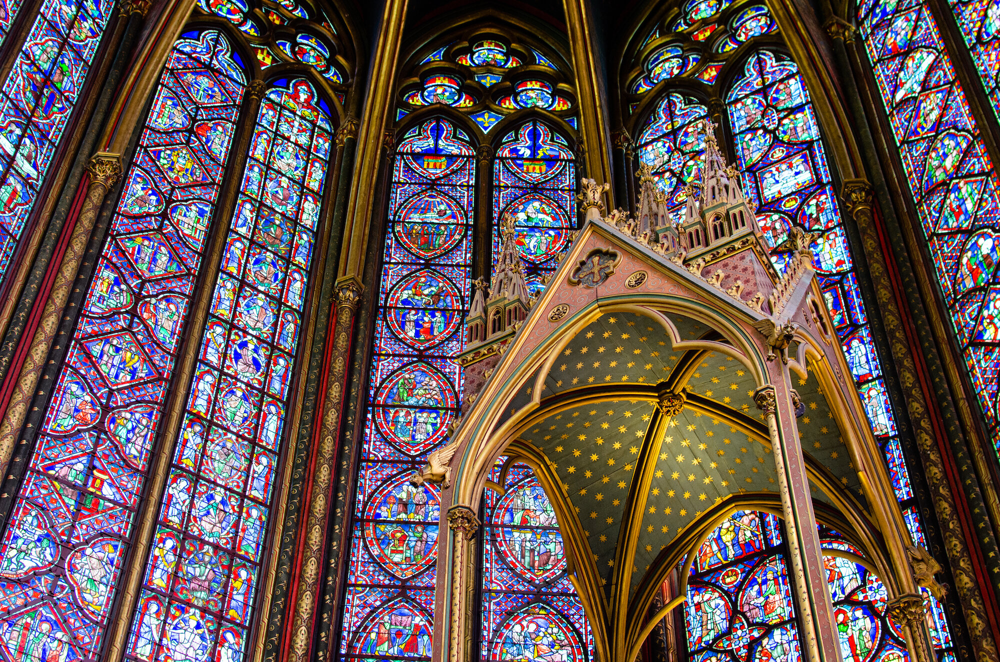

**3 P.M.** — Take a short walk on the Île de la Cité to the Palais de la Cité, the residence of the Kings of France until the 14th century.

Lesser known yet one of the most breathtaking chapels in the world, **Sainte-Chapelle** is a royal Gothic style chapel inside the medieval palace. The chapel was commissioned by King Louis IX to house his collection of Passion relics, though the real wow factor of this chapel is the towering stained glass windows displaying iconographical Christian stories. A MUST!

Make sure to pick up a brochure at the entrance as it explains each panel’s design as well as the history of the chapel.

**4 P.M.** — Walk across the bridge to **Shakespeare & Company** (37 Rue de la Bûcherie, 75005 Paris). Perhaps the most famous independent bookstore in the world, this shop with its green and yellow façade, rustic signage, and literally collection has people overflowing onto the sidewalk in reminiscent of days of Paris past. 

**4:30 P.M.** — Hop back on at Stop: Saint-Michel - face au 27 quai Saint-Michel : Sainte Chapelle Conciergerie and ride it to Stop: Champs-Elysées Clemenceau to explore Place de la Concorde.

This large public square was the site of many notable public executions (by guillotine) during the French Revolution including King Louis XVI, Queen Marie Antoinette, and Madame du Barry. Walk around the square and check out all its features. 

The giant Egyptian obelisk at the center was given to the French by the Egyptian government and is decorated with hieroglyphics exalting the reign of the pharaoh Ramesses II. 

The two fountains feature stone basins and figures with tritons. The north fountain represents the Rhone and the Rhine, and symbolizes the importance of rivers for agriculture, navigation, and industry; while the south fountain represents the seas for harvesting fish, commerce, and navigation.

On the outer edges in each of the eight angles of the plaza are statues representing different French cities.

**5:30 P.M.** — Hop back on and complete the route, or hop off at any of the remaining stops you find interesting. You can ride the route as many times as you like. Ride it around again to get off at one of the early stops, just keep an eye on the last departure times, if you plan on taking the bus back to the beginning or whoever your final stop may be,

**7:30 P.M.** — Bet you’re hungry! Grab dinner out and about and/or perhaps select an activity from the optional evening activities listed under the “Other” header at the bottom of this page.

<v-divider label="Day 3" />

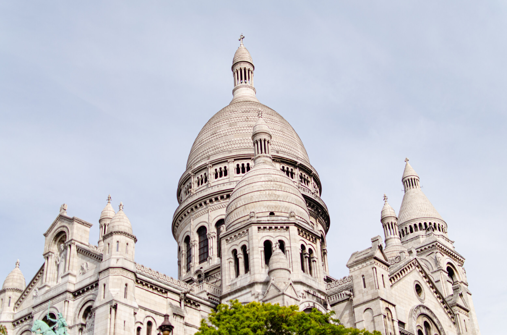

| | |
| - | - |
| 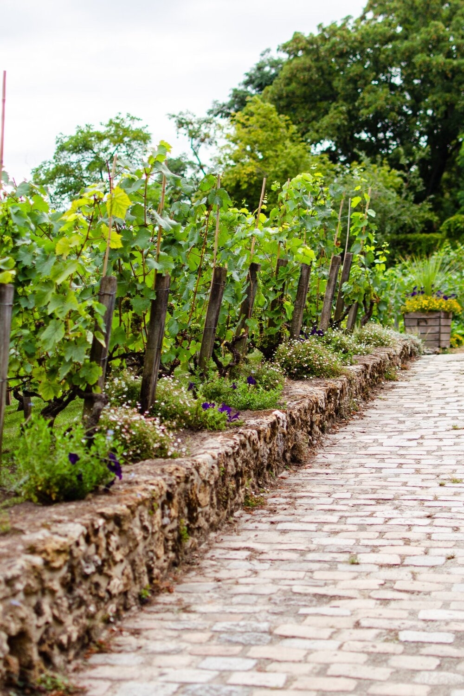 | 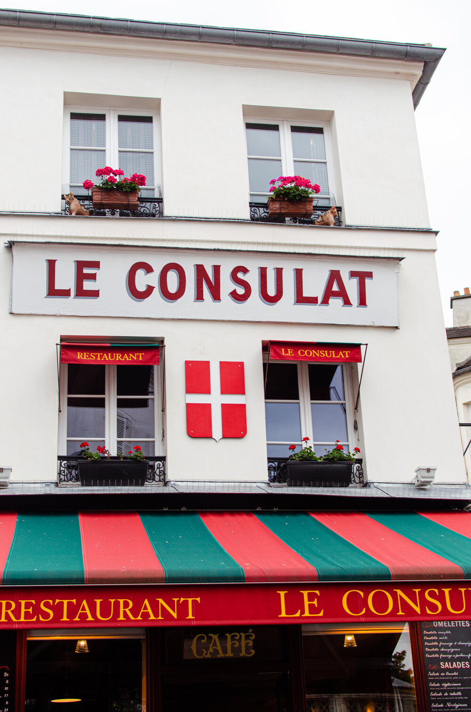 |

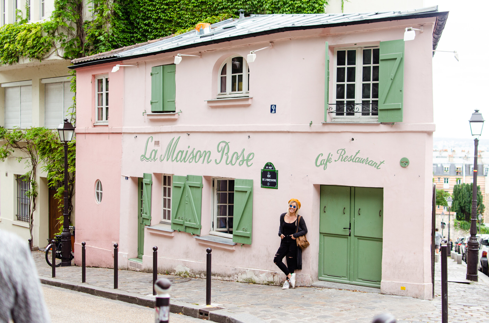

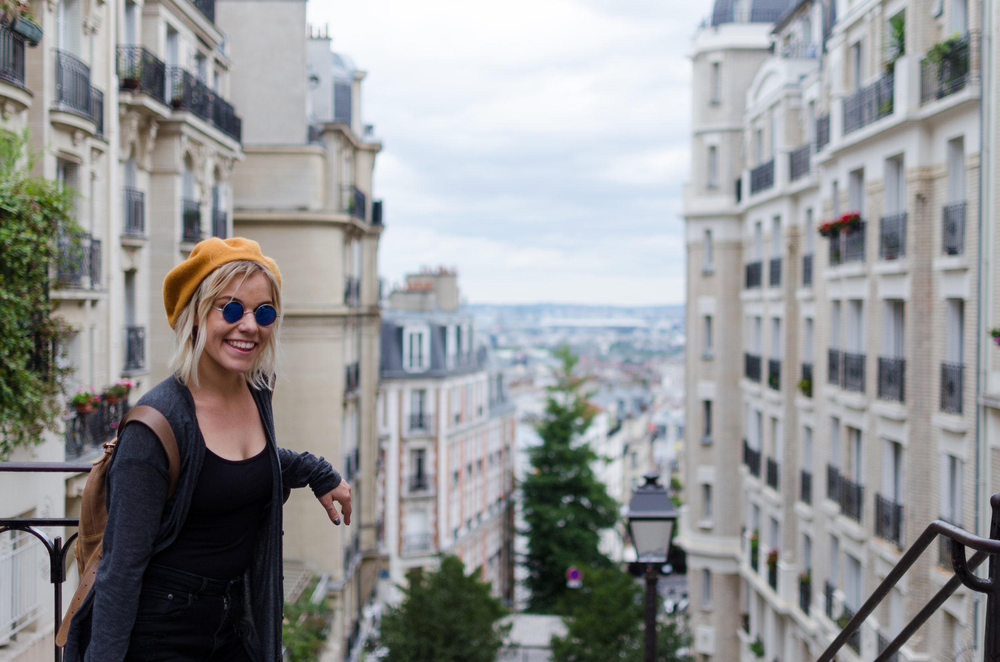

## MONTMARTRE

Cobblestone lanes, tiny squares, working artists, and panoramic views, there’s no question that Montmartre is the most romantic charming village in Paris.

The area’s modern claim to fame came during the 19th century, when Belle Epoque artists and bohemians began to move up the hill for the cheap rent. Montmartre became the place for artists like Salvadore Dali, Henri Toulouse-Latrec, Pablo Picasso, and Vincent Van Gogh, among freethinkers, writers, and more. The neighborhood’s reputation for a good party quickly spread and the cabarets and bars popped up everywhere.

**8:45 A.M.** — Hop on the Paris L’Open Bus Tour’s yellow route to Montmartre, starting at Stop: Auber - 13 rue Auber 75009 Paris. Then disembark at Stop: Montmartre-Anvers.

**9:30 A.M.** — Grab brunch at **The Hardware Société** (10 Rue Lamarck, 75018 Paris, France).

**10:30 A.M.** — With a full belly head up Montmartre’s steps to **Basilique du Sacre-Coeur de Montmartre**.

Entrance is free to the Basilica and the queue moves quite quick. The beautiful exterior is complimented on the interior with mosaics, spiraling steps, bells, and stained glass windows.

For views of Paris, climb the 300 steps to the Basicilia’s Dome.

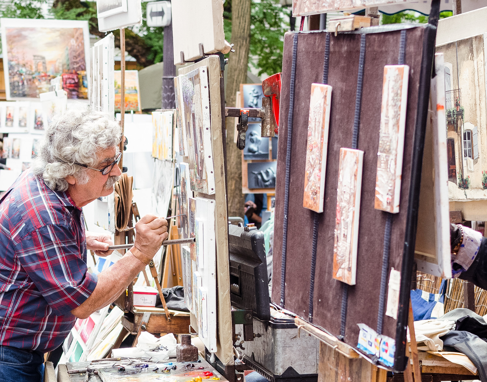

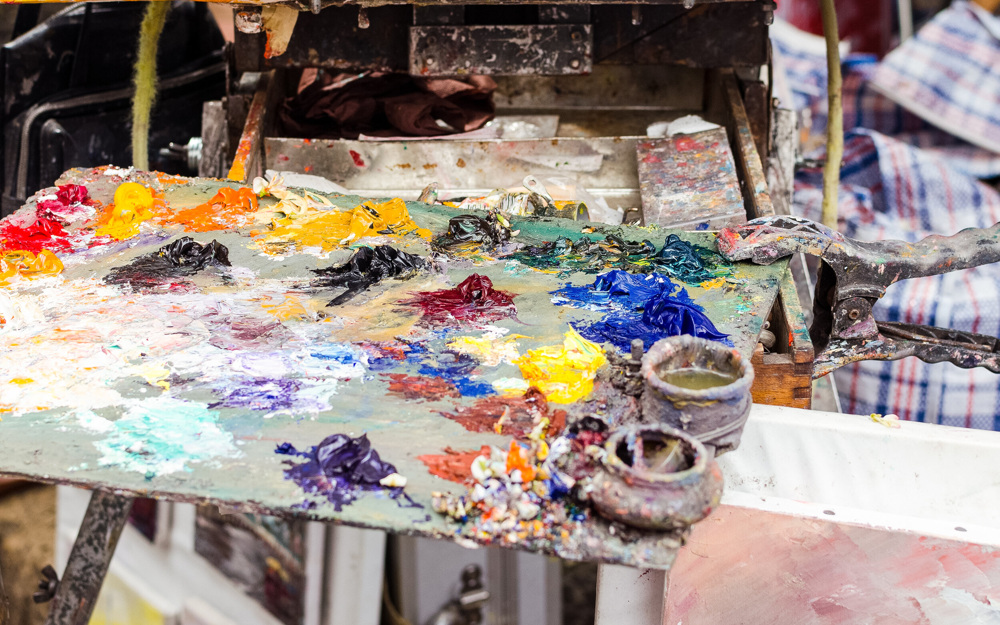

**12 P.M.** — Head down the street to the **Place du Tertre**, which is filled with portrait sketchers, caricaturists, and painters trying to make some money. It’s primarily for tourists, but it’s fun to window shop and a great reminder of the artistic past of the neighborhood.

**1 P.M.** — While walking around, find a lovely cafe for some lunch at or get takeaway and enjoy it on the steps of Montmartre, taking in the view over the city and people watching. Then continue walking around the neighborhood as the area behind the basilica is the most charming area—cobblestone lanes, street lamps, staircases! Oh la la, J’adore!

The Place du Calvaire has one of these long, beautiful staircases that’s worth checking out. If you keep climbing, you’ll get one of the best views of the Eiffel Tour among chimneys and tin roofs.

**3 P.M.** — Kicki kicki ya ya! When you head back to the bus stop, you can’t miss the famous red windmill of the **Moulin Rouge**. The birthplace of the modern can-can dance, the Moulin Rouge is credited for introducing a can-can revue of courtesans that led to the cabarets opening up around Europe.

**3:30 P.M.** — Hop back on the bus at the stop you disembarked at and complete the line. 

**4 P.M.** — Once you’re back where you started this morning, walk a few streets over the **Boulevard Haussmann** where you’ll find the fabulous Galeries Lafayette, a mecca for luxury brands and designers. Perfect for some window shopping (or actual shopping if the number of the price tag doesn’t scare you). Also check out French department store Printemps just down the street.

**8 P.M.** — Dinner time. We really enjoyed **NOGLU** (16 Passage des Panoramas, 75002 Paris) for their cozy alleyway setting and gluten-free menu.

<v-divider label="Day 4" />

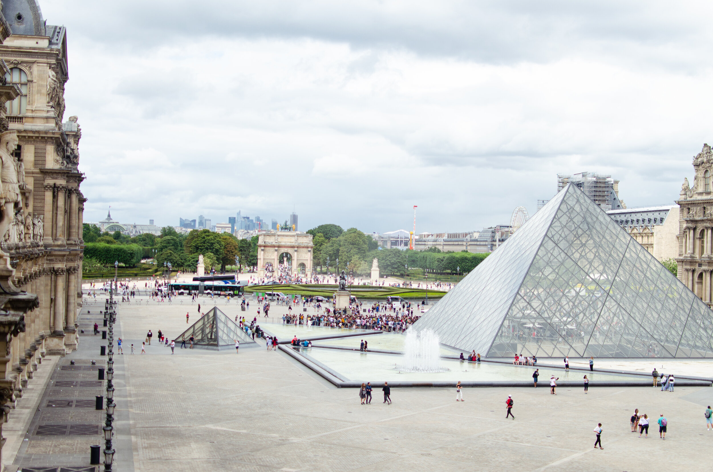

| | |
| - | - |
| 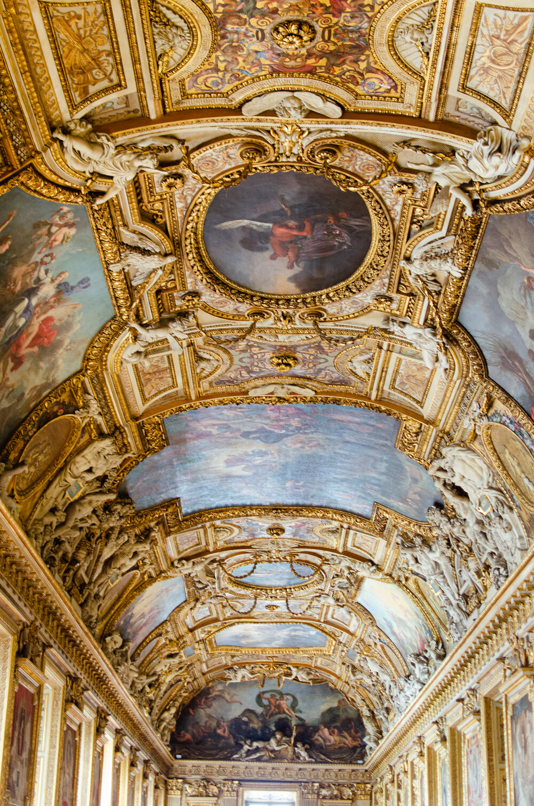 |  |

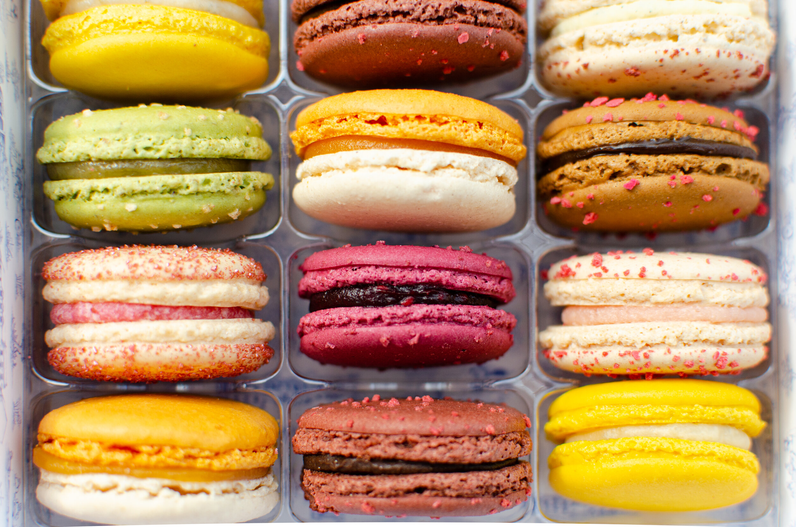

## I LOUVRE YOU!

**8 A.M.** — Breakfast. You’re gonna need the energy!

**9 A.M.** — Enter the **Louvre** during your assigned entry time. Purchase your admission ticket at least 2 weeks in advance for more choices on entry times. I would recommend the earliest entry to allow yourself the maximum amount of time for exploring. There’s a separate queue for those with entry-timed tickets and you’ll have to enter the pyramid within half and hour of the time on your ticket. 

Note: The Louvre is closed on Tuesdays and has extended hours on Wednesday and Fridays. Admission for visitors under 18 and 18-25 year-old residents of the EU is free.

The museum’s galleries are packed with treasures, but there are a few you shouldn’t miss:

>**La Joconde (The Mona Lisa)**  
Leonardo da Vinci’s painting holds the title for “the best know, the most visited, the most written about, the most sung about, and the most parodied world of art in the world.” You won’t be able to miss it as there will always be a huge crowd in front of the surprisingly small masterpiece.

>**The Venus de Milo**  
Believed to depict Aphrodite, the Greek goddess of love and beauty, this ancient statue was created sometime between 130 and 100 BCE entirely out of marble, and is the most famous Greek statue in the world.

>**The Great Sphinx of Tanis**  
The sphinx (creature with the body of a lion and the head of a king) is a symbolic representation of the close relationship between the sun god and the king, demonstrating his strength and close association with Ra as “the living image of the king.” This sphinx is one of the largest outside of Egypt.

>**The Winged Victory of Samothrace**  
The most influential Greek sculptures in the history of Western art, is a technical masterpiece (Note: the wind ruffling Victory’s dress). Only a fraction of the ancient Greek statures chiseled from stone survive to this day, over 2,200 years!

Spend as much time as you want in the museum’s more than 15 acres of galleries. Around every corner, another breathtaking work. Don’t forget to grab a quick lunch from one of the vendors in the museum. There is no re-entry so make sure you’re done before you head out.

**6 P.M.** — By now chances are you’ll be museum’d out and need a pick me up. Head around the corner through the Jardin du Palais Royal to **Senoble Pâtisserie** (11 Rue des Petits Champs, 75001 Paris, France) and get a box of assorted macarons and/or other tasty desserts then head back towards the Louvre and enjoy your treats in the Tuileries Garden. Admire the French formal garden design and small-scale amusement park.

**8 P.M.** — Dinner time!

**10 P.M.** — I’d recommend a moonlight stroll along the seine, weather permitting. Check out the optional evening activities listed in the “other” section of this page.

<v-divider label="Day 5" />

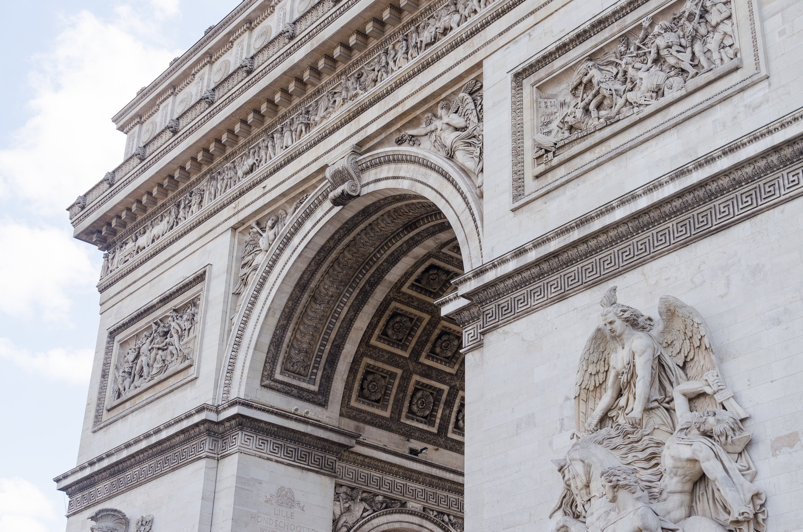

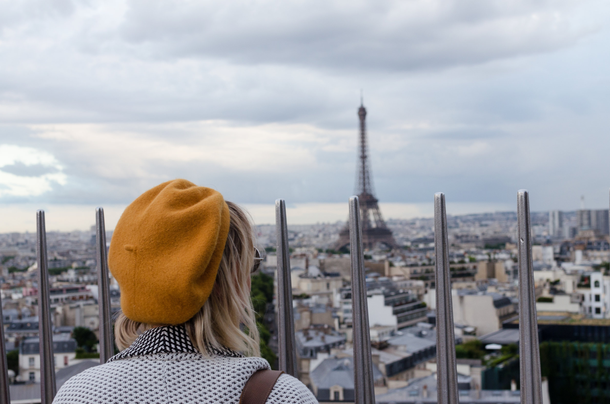

## CHAMPS-ELYSÉES

**9 A.M.** — Breakfast or en français, un petit déjeuner!

**10 A.M.** — Dealer’s choice—Explore the collections at the Grand Palais, Petit Palais, or Les Invalides. Whatever you choose, make sure you book your tickets in advance (this is a reoccurring tip when visiting Paris). 

> **Le Grand Palais**  
Built for the 1900 Exposition Universelle (the World Fair of 1900), Le Grand Palais is a premier venue for large-scale temporary exhibits in its National Galleries and the permanent adjoining Palais de la Découverte (Palace of Discovery) which is the city’s museum dedicated to science and natural history.*

> **Le Petite Palais**  
Also built for the 1900 Exposition Universelle, the buildings now house the city’s museum of fine arts’ permanent collections that include works by Rembrandt, Fragonard, Pissarro, Cézanne, Modigliani, and Rodin, among others, as well as a wide range of unique temporary exhibitions.*

> **Les Invalides**  
This beautiful golden dome and canons welcome visitors to the grounds that include a church, war museum, and the final resting place of French Emperor Napoleon.*

**3:30 P.M.** — *Aux Champs-Elysées, Aux Champs-Elysées!* The most famous avenues in the world. Songs have been written about it! Songs that are catchy and get stuck in your head for a long, long time. Blah! 

Drawing a line from the Louvre through the Place Concord to the Arc de Triomphe, this wide road’s name translates to "Elysian Fields,” meaning the street is heaven on earth, and is lined with restaurants, cafes, luxury boutiques, and gorgeous hotels. It’s the perfect place for people watching and window shopping (or actual shopping if you find yourself flush with ca$h!)

If you’re looking for even higher-end boutiques, stroll down Montaigne Avenue just around the Arc de Triomphe.

**7 P.M.** — Perhaps during your wanderings you found a restaurant that looked delicious. If so, head there. If not, there is no shortage of restaurants around this road and it’s home to some of the city’s best. Enjoy!

**9:30 P.M.** — Join the quick moving queue, purchase tickets, and ascend the center piece of the Champs-Elysées’ étoile, **the Arc de Triomphe**.

Commissioned by French Emperor Napoleon, the design was so elaborate it ended up taking 30 years to complete!

The interior includes an exhibit about the construction, history and current events that the arc is the centerpiece of.

Ascend to the viewing platform on the top of arch via 284 steps and enjoy 360 degree views of the city and the avenues with the arc at the center.

Since you’ll be visiting in the evening, make sure you are at the top on the hour as the Eiffel Tower will twinkle just across the way. Fun fact: we watched the lights on the Eiffel Tower sparkle from the top of the arc the evening we got engaged! It was magical!

**Important note:** Do NOT try and cross the traffic around the Arc de Triomphe. There are pedestrian tunnels under the roundabout that will get you safely to the base of the arc.

<v-divider label="Other" />

**Enjoy a Cabaret Show**  
For a kitschy fun evening out, check out a Parisian cabaret—Colorful, avant-garde performers, French cancans, Vegas glitz, and lots of skin…oh la la! The most iconic, The Moulin Rouge, birthplace of the can can, but the bohemian performances of old have been replaced with a well orchestrated variety show, dinner theater.

We actually love burlesque and attend several shows throughout a regular year so we are a bit more judgmental than most. We did have a fabulous time at The Crazy Horse Paris. The show is apparently a bit racier than the others, but we saw several unique routines and use of technology different from anything we had previously seen. 

Another option would be Lido de Paris. Just make sure to purchase tickets in advance.

**Mystery, Mayhem, and Murder?!**  
For someone who gets scared easily I have done a surprising number of nighttime ghost and legend tour, and well Paris’ spotted history is full of secrets, ghost stories, conspiracies, assassinations, and more. For a different, darker side of the City of Lights, look into the [Ghost and Mystery Night Walking Tour of Paris][1]. 

[1]: https://www.viator.com/tours/Paris/Ghost-and-Mystery-Walking-Tour-of-Paris/d479-2050P189

**Marvel at La Ville-Lumière (The City of Lights)**  
For a relaxing, laid-back evening hop on a bateau for a cruise down the Seine. This important waterway will give you a different perspective and get you up close to many major landmarks and bridges as you drift along.

There are also dinner cruises if you want to combine two activities.

**Get Your Culture On!**  
How does an evening at the opera sound? Check the schedule at the Belle-Belle-Époque style Palais Garnier. If the opera is not for you, the venue also hosts ballet, concerts, and other performances throughout the year.

**Take a Moonlit Stroll Around Paris**  
Ever see Midnight in Paris? There’s something so enchanting about strolling through the historic Parisian streets at nightfall. I’d recommend strolling around the Ile de la Cité, Pont Neuf, and the Pont des Arts, specifically checking out the Notre-Dame Cathedral. Of course, be vigilant and stay safe.
